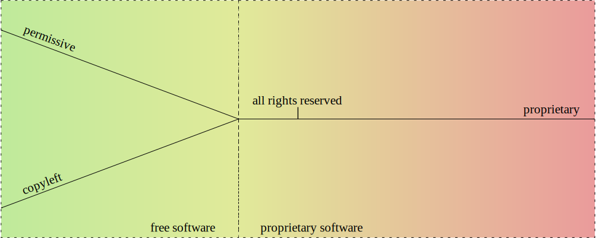
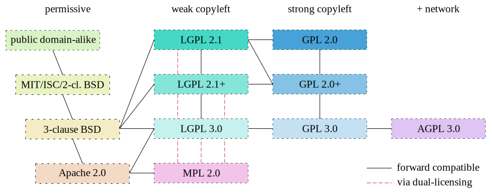

===================================================
A copyright primer (not only) for Gentoo developers
===================================================
:Author: Michał Górny
:Date: 2020-08-24
:Version: 0.1
:Copyright: https://creativecommons.org/licenses/by/4.0/

.. warning::
   This article is still a work-in-progress.  The subject matter
   is a very tough one, and mistakes are possible.  I have been focusing
   on verifying what I know based on the U.S. copyright law.  Everything
   still needs to be verified for other jurisdictions, and proofread
   by someone with more experience and knowledge.

.. contents::

Preface
=======

Disclaimer
----------
I am not a lawyer.  The information presented here is based on various
(hopefully trustworthy) sources.  While I have put my best effort
to keep this correct, it is entirely possible that some of it may
be incorrect, outdated or simply do not apply in a specific
jurisdiction.  Use at your own risk, and if in doubt, consult a lawyer.

Purpose of this guide
---------------------
The purpose of this guide is to provide a single source of copyright
information that could be helpful to people like me — software
developers and packagers.  Unlike many other guides that can be found
online, this one does not focus on a single jurisdiction.  Instead,
I have chosen to attempt to provide a broader view that is important
to international projects like Gentoo, whose authors and users can
be spread all across the world.

I have deliberately decided to focus on the wording of the laws
and the spirit of licenses.  I do realize that in many cases it is
doubtful whether something is actually enforceable.  Nevertheless,
I do not believe we should be encouraging violating copyright just
because we are unlikely to be (successfully) sued.

This guide should be by no means considered complete or final.  I plan
to update it as I find or receive new information.  If you find
a mistake, an outdated information or simply think something should
be extended, please do not hesitate to contact me.

Basics
======

Copyright law and its scope
---------------------------
The purpose of *copyright law* is to protect creative work.  It is
important to understand that copyright covers only work that was
actually created and recorded, and to the scope of its actual text,
implementation, representation.  It does not cover ideas or concepts.
[#COPYRIGHT-BASICS]_

To explain this better, let's suppose you came up with a great program
called Frobnicate.  Once you start writing the code, it becomes
protected by copyright.  This means that if somebody copied *your code*
without permission, that would constitute a copyright violation.
However, the copyright law does not prohibit others from independently
writing an equivalent program, as long as that person does not actually
copy your code.

Of course, once somebody starts to reimplement something, and especially
if the number of possible implementations is limited, we get into muddy
waters.  How do you prove that something was reimplemented independently
and not just copied and modified?  Some projects are using a technique
called clean room design to achieve that.  The work is then done by two
disjoint teams.  One team has access to the original implementation,
and uses it to write a textual specification of how it works without
including any potentially copyrighted material.  The other team writes
code from the specification without actually looking at the original
program.  [#CLEAN-ROOM]_

There is no such a thing as a global copyright law.  Every country has
its own laws, and cross-country agreements are made to cover protection
of work abroad.  Nevertheless, there are some global standards set
by international conventions, most notably the Berne Convention.
[#BERNE]_

Copyright applies to creative work from the moment of its recording.
While at least some countries provide a means of registering copyright,
the registration is not necessary for it to apply.  It is important
to understand that copyright applies even if the author does not include
a copyright notice or the work is published pseudonymously.

Other IP laws
-------------
Besides copyright law, I would like to shortly discuss two other laws
that could be of relevance when dealing with intellectual property:
patents and trademarks.  Both are outside the scope of this guide
but they can nevertheless impact the developer's work.

*Patent law* focuses on protecting new and creative inventions.  Unlike
copyright law, it does not focus on the actual implementation but
on the idea itself.  You could say that it complements copyright.  While
the latter can prevent others from copying (plagiarising) your work,
patents can prevent others from reimplementing the same idea.
[#PATENT]_

Patent law does not apply to inventions automatically.  Instead, one has
to explicitly apply for one, and do it separately for every jurisdiction
where the patent is meant to apply.  Patents are meant to be granted
only for new and original inventions.

The exact range of patentable ideas differ from country to country.
For our purposes, the most important part are software patents.  They
are often considered harmful by the open source community, preventing
development of free alternatives to proprietary software.  For example,
MPEG Layer III (mp3) encoding software was affected by patents until
their expiration in 2017.  At the moment of writing, patents on computer
software are permitted e.g. in United States but not in the European
Union.  [#SOFTWARE-PATENTS-IN-EU]_

One particularly gruesome aspect of the patent law are so-called
patent trolls.  These are entities that focus on obtaining and using
patents that they do not intent on creatively using them in their own
products but only to enforce them on other companies.  [#PATENT-TROLL]_

One interesting example of this is the Eolas patent.  The company
has patented what used to be known as browser plugins (e.g. the Flash
plugin).  This patent has affected all major browser vendors, including
authors of open-source web browsers, resulting in a large number
of lawsuits and a few creative mitigations.  [#EOLAS]_

*Trademark law* focuses on protecting product brands.  The idea is that
if you market your product under a specific brand, others can not use
the same (or confusingly similar) brand for their products in the same
area of business.  The goal is twofold: on one hand to prevent your
competitors from taking advantage of your reputation, and on the other
to prevent them from damaging it through their product.

Trademarks generally start being protected automatically once they
become recognizable enough.  However, they can also be registered
to grant them stronger protection.  It is a common practice to mark
unregistered trademarks via the ™ symbol, and registered via the ®
symbol.

Trademarks are important to open source projects as well as businesses.
The Gentoo name and logo are registered trademarks in order to protect
them from being used to create another Linux distribution with the same
name and creating confusion as to which is which.

Original and derivative work, or what is copyrighted
----------------------------------------------------
In order to understand some of the further concepts in this article,
it is necessary to introduce two important terms: *original work*
and *derivative work*.

*Original work* means a new creative work that has been created
independently of any other existing work.  Notably, this means that
the author(s) (or other copyright holders) hold the sole copyright
to this work.

*Derivative work* is a work that is derived from existing work(s),
either original or derivative.  In a derivative work, new copyright
applies only to the original work of its author.  However,
the copyrights of its underlying works still apply to the respective
parts of the work.

In some cases, the derivative work will merely be a *compilation*
of existing data, without any new original data.  However,
if the task of combining the data carries the notion of creativity, then
the new copyright of derivative work will apply to this creative
compilation.  Otherwise, the derivative work will not carry any new
value, it will not be copyrightable beyond its original parts.

It is important to note that the author of derivative work must be
permitted to incorporate the underlying works in it.  Otherwise,
the derivative work may constitute copyright infringement
and the original part of it may not be covered be copyright protection.
[#COPYRIGHT-DERIVATIVE]_

Let's say you've written some entirely new function in a programming
language.  Provided enough creativity, the code of this function
constitutes an original work.  Now, if someone updates the code of this
function, the resulting function is a derivative work of your function,
and adds the copyright of the person modifying it.  A source code unit
is a derivative work of all the code inside it.  A compiled object file
is a derivative work of the source code (and possibly of the act of
compiling, if it is not purely mechanical), an executable
is a derivative of object files (and the act of linking), a package
is a derivative of all the files within it (and the act of packaging).
This example shows how individual copyrights on program parts build up
the copyright of the whole program.

What is not covered by copyright
--------------------------------
Not everything is covered by copyright.  The work that is not
copyrighted is generally called to be in *public domain*.  The exact
rules to what constitutes public domain vary from country to country
but I will attempt to cover a few common groups.

Firstly, copyright does not protect works that *do not constitute enough
originality*.  Everyday sentences, drawings, titles, slogans are clearly
not copyrightable.  The exact line between what is copyrightable
and what is not can be very thin and depend on interpretation.  Some
argue that e.g. configuration files or plain data files (including e.g.
systemd units) are not copyrightable.

Secondly, public domain includes works that the copyright has *expired*
for.  The exact rules for expiration vary across the globe, and may
depend on the category of works, time of publication, whether it was
published pseudonymously.  The copyright length is counted either
from author's death or from publication date.  Wikipedia includes
a compiled list (and a map) of copyright lengths in different countries.
[#COPYRIGHT-LENGTHS]_

It is important to emphasize two facts here: that in international
projects such as Gentoo it is important to account for the longest
possible copyright length, and that copyright expiration does not extend
to derivative works.  While we can safely assume that Homer's Iliad is
not copyrighted in original, its modern translation is covered
by the translator's copyright.

Thirdly, specific works can be excluded from being covered by copyright
by the applicable law.  For example, the works of the United States
government are normally not protected by copyright in the US.
[#COPYRIGHT-US-GOV]_

Fourthly, there are cases of authors voluntarily withdrawing their
exclusive rights and publishing their works as public domain.  This
concept is arguable under some jurisdictions, and I will discuss this
problem in greater detail in the section on licenses.

The works in public domain can be freely used, reproduced, modified,
etc. without limitations.  They can also be used to create derivative
works.  However, the derivative works of public domain materials may
be protected by copyright if they include original content of their
author.

More on copyright
-----------------
More information on the copyrigh in the United States can be found
in `circulars issued by the U.S. Copyright Office`_.

.. _circulars issued by the U.S. Copyright Office:
   https://www.copyright.gov/circs/

Licenses
========

Overview of license types
-------------------------
In the most broad sense, *license* explains the rights and restrictions
granted by the copyright owner.  Some copyright holders use custom
license texts, while others resort to well-known public licenses.
License notices range from one-sentence right grants, through varied
length licenses to End User License Agreements written in the form
of a legal contract.

For our purposes, let's split licenses into a few groups, roughly
presented in the following diagram.

At the central point of the diagram, `all rights reserved`_ is found.
It represents the default rights granted by the copyright law,
i.e. the case when no specific license is provided.  From there, we can
either go in the direction of more restrictive proprietary licenses,
or less restrictive licenses.  The former route has no further features,
so let's focus on the latter.

If we go in the way of less restrictive licenses, we eventually leave
the area of `proprietary software`_ and find ourselves in `free
software`_ licenses.  These are the licenses that grant
us the elementary freedoms that I will explain shortly.

At this point, the path forks and we have two options.  If we turn left,
we go into `copyleft licenses`_ that not only grant users freedoms but
also require derivative works to preserve these freedoms.  If we turn
right, we go into `permissive licenses`_ that do not have
the aforementioned restriction.

I will now explain all the license groups in detail.

All rights reserved
-------------------
This is a term historically used in copyright notices.  While today it
is no longer necessary to use it, it is sometimes used as an indication
that the package is copyrighted and the copyright holder does not grant
you any additional rights beyond these implied by the copyright law
(and did not add any additional restrictions).

The exact extent of laws granted depends on the jurisdiction
and the type of work.  In general, you can use (run, read, view)
any work that you have obtained lawfully (e.g. by buying it or fetching
from an official website).  Usually, you can also modify it for your
private use.

You are not allowed to redistribute the program or make derivative works
from it.  Even if the program is freely redistributed via a website,
it is exclusive copyright owner's right to do that.  This is especially
problematic for packaging because if the original source disappears
(upstream removes old version, stops distributing the software, goes
bankrupt), it becomes no longer possible to install the package on new
systems.

Free software
-------------
*Free software* is software that respects the user's freedom.  The GNU
project explains it through four essential freedoms:

    - The freedom to run the program as you wish, for any purpose
      (freedom 0).

    - The freedom to study how the program works, and change it so it
      does your computing as you wish (freedom 1).  Access to the source
      code is a precondition for this.

    - The freedom to redistribute copies so you can help others (freedom
      2).

    - The freedom to distribute copies of your modified versions to
      others (freedom 3).  By doing this you can give the whole
      community a chance to benefit from your changes.  Access to
      the source code is a precondition for this.  [#GNU-FREE-SOFTWARE]_

Essentially, software that grants these freedoms without limitations
is called free software.

It is essential to note that this is not about cost.  It is entirely
valid to sell free software — as long as the buyer obtains the license
to modify and redistribute it (possibly for free!)

Proprietary software
--------------------
*Proprietary software* is software that is not free software.  This
includes the all-rights-reserved software, as well as less restrictive
licenses (as long as they don't grant all four freedoms) and more
restrictive licenses.

One particular case of proprietary license is a *free distribution*
license that permits redistributing the original packages.  This makes
it possible to mirror sources and continue using the package once
upstream stops providing the download.  However, these licenses do not
provide all four freedoms.

Common limitations of proprietary licenses are:

- restricting the right to use for commercial purposes,

- adding so-called do-no-harm clauses that limit usage (even if this
  seems superficial or unharmful),

- restricting commercial redistribution,

- restricting redistribution of modified copies.

A special case of proprietary licenses are End User License Agreements.
These are written in contract form, and require explicit agreement
to their terms before installing (or using) the software.

Permissive licenses
-------------------
*Permissive licenses* is the term used to distinguish free software
licenses that are not copyleft.  They are permissive in the sense that
they permit the relevant code (or more generally work) to be reused
in non-free derivative works.

In other words, if you take, say, a BSD-licensed code snippet
and include it in your program, you can afterwards make it proprietary
and choose not to release the source code, as long as you include
an appropriate copyright notice.  You can also freely modify the code
without having to share your modifications.

This feature makes permissive licenses preferable to commercial
companies working with open source.  They make it possible to easily
reuse open source projects in their commercial code, or to create
commercial versions parallel to open source projects.

A major advantage of a few common permissive licenses is that they are
trivial, and therefore easy to understand for a regular programmer.
These include the BSD licenses (`2-clause BSD`_ and `3-clause BSD`_
being the most common), MIT_, ISC_ and so on.  These licenses focus
on granting you the necessary freedoms, with minimum requirements that
generally boil down to attribution.

Another common permissive license is `Apache 2.0`_.  This one's a big
longer and more complex but it has the additional feature of granting
you patent license for all the contributed code.

For non-software works, a common example of permissive licenses
are Creative Commons Attribution licenses (`CC BY 4.0`_).

Public domain and public domain-alike licenses
----------------------------------------------
As explained above, *public domain* means works that are not covered
by copyright.  In this section, I would like to focus on authors
expressly dedicating their work to public domain.  This means that you
can use the software in any way with no restrictions, and notably
without the need to attribute the original author.

However, in some jurisdictions (particularly in the EU) the copyright
law does not permit waiving all the rights granted by copyright.
Arguably, this might make public domain dedications void.  For this
reason, it is recommended to use a public domain-alike license instead.
An example of such a license is Creative Commons Zero (CC0_) license
that explicitly waives as many rights as possible within the applicable
law.  [#CC-ZERO]_

Another similar license is called Unlicense_.  It takes a mixed approach
of dedicating the software into public domain first, and adding
a fallback license for jurisdictions where the former is not recognized.

Copyleft licenses
-----------------
*Copyleft licenses* are free software licenses that not only grant
freedoms but also require them to be preserved in (some kinds of)
derivative works.  The copyleft can either be weak or strong.  A *weak
copyleft* requires any modifications to the code in question to be
released under matching license.  A *strong copyleft* requires anything
using the code in question to use such a license.

Let's take an example.  You have written a library implementing some
algorithm, and I am writing a proprietary program using this library.
Now let's suppose that I found a way to optimize the algorithm
to perform twice as fast.  Now, if you used a permissive license then
I could keep the improved algorithm proprietary, and sell my product
as faster than my competition.  However, if you used a weak copyleft
license then I would have to publish my changes, and you could merge
them back making the competition as fast as my program.

At least that's the theory.  In reality, I might as well decide
to contribute back to permissively licensed project.  Or I might have
ignored the copylefted project and implemented the algorithm myself
to avoid having to contribute back.

Strong copyleft goes even further.  Let's suppose I found a creative use
of your library and want to implement a program.  If the library is
not covered by strong copyleft, I am permitted to create a proprietary
program and make money from the creative use of your algorithm.
However, if you used strong copyleft, I would have to publish my program
as free software as well.

Let's cover a few basic examples of copyleft software licenses.

Mozilla Public License 2.0 (`MPL 2.0`_) is a weak copyleft license.  It
is limited to file scope.  This means that if a file includes MPL
2-licensed code, the whole file must be released under this license,
including your modifications to the code (if any).  However, the rest of
your project can use any license, including proprietary licenses.
[#MPL2]_

GNU Lesser General Public License (`LGPL 3.0`_) is weak copyleft
as well.  It is limited to library scope.  If you wish to use
a LGPL-licensed library, then you must redistribute the library under
the same (or stronger) license, along with your potential modifications.
Furthermore, if you choose to link the library statically, the license
requires you to provide the user with a means of relinking your program
with a different version of the library.  The official GNU FAQ indicates
that this does not require releasing the source code, and instead it is
sufficient to provide the rest of your program in compiled object form.

GNU General Public License (`GPL 3.0`_) is a strong copyleft license.
It extends to the whole executable, including dynamically linked
libraries.  If you wish to use a static or shared GPL library in your
program, your program must be redistributed as GPL as well.

GNU Affero GPL (`AGPL 3.0`_) updates the previous license to suit
network-oriented world better.  Plain GPL serves it purpose only for
software that is actually meant to be redistributed.  If you build
proprietary software that runs on web servers, you normally do not
distribute program sources and binaries.  AGPL accounts for this.
If your network application is using any AGPL code or libraries,
the application itself needs to use AGPL too and you are required
to permit users interacting with your application to download its code.
[#GPL-FAQ]_

The primary reason for using copyleft licenses is to prevent improved
versions of free software becoming proprietary.  On one hand, this is
important to users who might have invested their effort and money
to the particular piece of software and do not wish to discover that
the free software version has been discontinued in favor of something
proprietary.  On the other hand, this is important to software
developers who do not wish their software to be forked and turned into
proprietary competition.

There is some controversy over GPL licenses.  It is argued that dynamic
linking to a library may not be sufficient to call a program its
derivative work, and therefore enforce GPL on it.  Furthermore, it is
possible to use a thin (L)GPL wrapper with linking exception
to workaround GPL limitations, as nVidia proprietary drivers do (to link
proprietary code to a GPL kernel).  [#GPL-LINK]_

Grsecurity is one example where GPL failed.  The project's sources
are licensed GPL-2 because they're built on the Linux kernel.  However,
the company is charging for access (which is acceptable per the GPL)
and punishing the users for redistributing the sources (which is
the users' right according to GPL) by terminating the access to updates.
Bruce Perens indicated that this additional term is in violation
of the GPL.  However, to the best of my information this has not been
actually tested in court.  [#GRSEC]_

Another major controversy has been caused by Oracle's switch of Berkeley
DB license to dual-licensing between commercial license and AGPL.  This
meant that all applications linking (even indirectly) to Berkeley DB now
not only have to use AGPL but also all network-oriented apps are
required to publish their sources under AGPL.  Many users felt that this
change was made purely to trick unknowing users into purchasing
the commercial license.  [#BDB-AGPL]_

Quick index of popular licenses
-------------------------------
Copyleft license list
~~~~~~~~~~~~~~~~~~~~~
Weak copyleft for software:

- Mozilla Public License 2.0: `MPL 2.0`_
- GNU Lesser General Public License: `LGPL 3.0`_, `LGPL 2.1`_

Strong copyleft for software:

- GNU General Public License: `GPL 3.0`_, `GPL 2.0`_
- GNU Affero General Public License: `AGPL 3.0`_

Documentation:

- GNU Free Documentation License: `FDL 1.3`_
- Creative Commons Attribution-ShareAlike `CC BY-SA 4.0`_

Other works:

- GNU General Public License: `GPL 3.0`_, `GPL 2.0`_
- Creative Commons Attribution-ShareAlike `CC BY-SA 4.0`_

.. _MPL 2.0: https://www.mozilla.org/en-US/MPL/2.0/
.. _LGPL 3.0: https://www.gnu.org/licenses/lgpl-3.0.en.html
.. _LGPL 2.1: https://www.gnu.org/licenses/old-licenses/lgpl-2.1.en.html
.. _GPL 3.0: https://www.gnu.org/licenses/gpl-3.0.en.html
.. _GPL 2.0: https://www.gnu.org/licenses/old-licenses/gpl-2.0.en.html
.. _AGPL 3.0: https://www.gnu.org/licenses/agpl-3.0.en.html
.. _FDL 1.3: https://www.gnu.org/licenses/fdl-1.3.html
.. _CC BY-SA 4.0: https://creativecommons.org/licenses/by-sa/4.0/

Permissive license list
~~~~~~~~~~~~~~~~~~~~~~~
Software:

- `Apache 2.0`_
- BSD: `2-clause BSD`_, `3-clause BSD`_
- ISC_
- MIT_

Documentation & other works:

- Creative Commons Attribution `CC BY 4.0`_

.. _Apache 2.0: http://www.apache.org/licenses/LICENSE-2.0.html
.. _2-clause BSD: https://opensource.org/licenses/BSD-2-Clause
.. _3-clause BSD: https://opensource.org/licenses/BSD-3-Clause
.. _ISC: https://opensource.org/licenses/ISC
.. _MIT: https://opensource.org/licenses/MIT
.. _CC BY 4.0: https://creativecommons.org/licenses/by/4.0/

Public domain-alike license list
~~~~~~~~~~~~~~~~~~~~~~~~~~~~~~~~
All kinds of works:

- CC0_
- Unlicense_

.. _CC0: https://creativecommons.org/publicdomain/zero/1.0/
.. _Unlicense: https://unlicense.org/

More on licenses
----------------
A comprehensive list of licenses with comments, including information
on GPL compatibility and Free Software status can be found on `GNU
project's Various Licenses and Comments about Them` page.

A list of licenses approved as Open Source along with their texts
can be found on `Open Source Initiative's Licenses & Standards` page.

Simple explanations of terms of various licenses can be found
on the `TLDRLegal`_ site.

A tabular comparison of various licenses can be found on `Wikipedia's
Comparison of free and open-source software licences`_.

Sites that focus on helping to choose a license include `OSS Watch
Licence Differentiator`_ and GitHub's `Choose a License`_.

.. _GNU project's Various Licenses and Comments about Them:
   https://www.gnu.org/licenses/license-list.html.en

.. _Open Source Initiative's Licenses & Standards:
   https://opensource.org/licenses

.. _TLDRLegal: https://tldrlegal.com/

.. _Wikipedia's Comparison of free and open-source software licences:
   https://en.wikipedia.org/wiki/Comparison_of_free_and_open-source_software_licences

.. _OSS Watch Licence Differentiator:
   http://oss-watch.ac.uk/apps/licdiff/

.. _Choose a License: https://choosealicense.com/

Copyright in (upstream) Free Software projects
==============================================

Choosing a license
------------------
Let's say you're starting a new project and want to consciously choose
a license that fits you.  Let's assume that you're not bound to use
any specific dependency yet, and there are no preconditions limiting
your choice.

For a start, ask yourself the following three questions:

1. Do I want to protect my work from becoming a proprietary product?

2. Do I want to be attributed whenever my work is used?

3. Do I want to keep rights to my work at all?

If you answered ‘yes’ to the first question, then you're looking for
a copyleft license.  If you answered ‘no’ to the first question
but ‘yes’ to at least one of the two remaining questions, permissive
license would work for you.  Finally, if you answered ‘no’ to all
of them, then a public domain-alike license would work for you.

Whichever option you choose, there's an additional question to ask:
do you want to ensure that yourself and your users are granted any
patent rights that might affect your code?

If you choose a copyleft license, then there are a few options.

If you only want your own code to remain free but do not mind using it
within non-free software, then `MPL 2.0`_ or `LGPL 3.0`_ would work for
you.  The main difference between these two is that LGPL additional
requires that the proprietary software permits your users to easily
replace your code with another version (e.g. by swapping a shared
library or relinking the program).

If you want to entirely prohibit building non-free software on top
of your code, then you're looking for a strong copyleft license.
For software that is traditionally distributed and run on user systems,
`GPL 3.0`_ is your choice.  For webapps and server software that can
interact with users without being installed on their systems, `AGPL
3.0`_ is better.

MPL and third versions of GNU licenses all include patent grant
and retaliation clauses.  Older versions of GNU licenses do not.

A common practice for using GNU licenses is to permit your users to
follow the terms of newer versions of the same license as well.  If you
choose do that, you must explicitly note so, e.g. in copyright notices.

If you choose a permissive license, then there's a whole lot to choose
from.  A recommended license with patent grants is `Apache 2.0`_.
If you don't want patent grants, a few popular options are MIT_, ISC_,
`2-clause BSD`_, `3-clause BSD`_.

Finally, if you choose a public domain-alike license, then common
options are CC0_ and Unlicense_.  These licenses *do not* include patent
clauses.

Copyright ownership
-------------------
Normally, copyright to a specific work belongs to its author.
An exception to this are *works made for hire*.  If the work is done
by an employee within the scope of employment, the copyright belongs
to the employer.

Initially, the copyright to your project will be solely yours.  However,
as it becomes more popular and more people start contributing patches,
various parts of it will hold many different copyrights.  For large
projects such as Gentoo, it is entirely normal to have thousands
of copyright holders.

Once the copyright is split between many entities, some of your
exclusive rights are limited.  This can in particular affect
relicensing_ but also e.g. issuing commercial licenses.  However, it
should be noted here that copyright ownership is entirely independent
to the governance of the project.

It is entirely normal that the original author may continue leading
the project even if other people now hold copyright to most of the code.
Of course, many projects actually do switch to a more community-oriented
governance model.  The project members generally can't take over
a project based on their copyright but they are within their right
to fork the project if they're unhappy with its governance.

Some projects recommend or require *copyright transfers* from their
contributors.  If you sign a copyright transfer, then the subject
of the transfer obtains copyright to the work in question.  This
practice makes it possible to keep all (or most of) copyright
to a project developed by a large number of contributors in single
hands.

Copyright notices
-----------------
The modern copyright law does not require works to carry prominent
copyright notices anymore.  Nevertheless, it is a good idea to do so.
Firstly, it makes it clear who holds copyright to the work (or parts
of it), when the copyright was applied (and therefore when it does
expire) and what rights are granted to your users.  Secondly, if it ever
comes to pursue copyright violations, lack of copyright notices can
be used to claim ‘innocent infringement’.

A typical copyright notice appears on top of the source file,
and consists of the word ‘copyright’ and/or the copyright sign ©,
followed by applicable years, followed by copyright owner.  It is
followed by an indication of license.  Some licenses (in particular
the GNU licenses) provide an explicit recommendation on how
the copyright notice should look like.

Ideally, projects keep track of all people who contributed non-trivial
changes.  The copyright notices are added for all copyright owners,
along with the dates of the first and their most recent contributions.
This makes it easy for anyone interested to determine the copyright
status of every file and to contact the copyright owners if necessary.

In some cases, tracking exact copyright ownership is considered
infeasible, and simplified copyright notices are used.  The Gentoo
copyright policy considers it sufficient to list the main copyright
holder, and use a single date span for all listed contributors.
Furthermore, it provides even simpler form of using ‘Gentoo Authors’
along with a VCS or an AUTHORS file.  [#GLEP76]_

To repeat: copyright notices are not required by law and there are
no formal requirements of how they need to look like.  Nevertheless,
including a detailed copyright notices is doing your users (and possibly
yourself, in the future) a service.

Contributor License Agreements, FLA and DCO
-------------------------------------------
While for small projects it is generally acceptable to accept
contributions without any further ado, large projects often find
themselves in need of stronger legal assurances.

A *Contributor License Agreement* is a contract between the project
and the contributor.  The exact extend of different CLAs differ
but in general they contain either a copyright assignment or copyright
grant, a patent grant, and a confirmation that the contributor has
the legal rights to grant all of that.

The CLA needs to be signed before the project in question accepts
any contributions.  In the act of signing, the contributor is generally
required to provide some personal data and contact information.  Some
therefore consider CLAs to be invading contributor's privacy.  [#CLA]_

The Fiduciary License Agreement (FLA_) is a specific variant of CLA that
is recommended to be used in Free Software.  FLA includes a copyright
assignment clause but it also prevents the new copyright owner from
making the software proprietary, at least within the extent of third
party contributions.

An alternative to CLAs is the Developer Certificate of Origin (DCO_).
It does not include copyright transfer, and instead assumes that all
copyright will be held by contributors.  It merely confirms that
the contributor has the right to submit it under project's license.
DCO is generally signed by adding a ``Signed-off-by`` note to the commit
message.  Therefore, unlike CLAs the signed certifications are part
of the repository rather than kept separately.

.. _FLA: https://fsfe.org/activities/fla/fla.en.html
.. _DCO: https://developercertificate.org/

License compatibility
---------------------
*License compatibility* is an utility concept to establish if two
licenses can be combined to create a new work.  License compatibility
is often unidirectional, i.e. work under license X can become part
of a larger work under license Y but not the other way around.

Generally, an output license is compatible with the input license
if it does not grant user any additional rights over the rights
over the input license, and does not remove any restrictions the input
license had.  While this may seem complex, it is pretty obvious if you
look at it this way: you can't grant your users any rights that
the original author did not grant them.

In some cases, licenses themselves provide *upgrade clauses*.  These
explicitly permit the user to use some other license for the work
in question.  For example, LGPL 3.0 permits upgrading to GPL 3.0,
and GPL 3.0 permits upgrading to AGPL 3.0.

David A. Wheeler has prepared a neat ‘license slide’ explaining how
commonly used licensed can be combined.  I have created a *license
compatibility graph* based on it, making it in SVG and updating
for MPL 2.0.

This graph is not a replacement for studying license terms but it can
give a quick answer whether having license X on input, we can get
license Y on output.  If you can find a path from the input license
to the output license, then the answer is yes.  If you have two licenses
on input, the one further alongside the path is your output license.

Public domain-alike licenses are our starting point.  Since they grant
user all the rights (or remove copyright entirely), the output can
be any other license.

They are followed by MIT/ISC/2-clause BSD group.  They all are roughly
the same, giving the user all freedoms but requiring attribution.
The work using these licenses can be used with all the licenses
following them.

The next position is the 3-clause BSD license.  It adds a clause
prohibiting using the author's name to promote derived work.  All
the remaining licenses can integrate 3-clause BSD code.

The last permissive license on the list is Apache 2.0 license.  It adds
significantly more clauses.  It accepts everything listed before
on input but on output it's limited to LGPL 3.0 (i.e. no older), MPL 2.0
and their successors on the list.

The second column includes weak copyleft licenses.  In the middle
there's LGPL-2.1+ that allows using LGPL 2.1 or LGPL 3.0.  All three
of these options can use 3-clause BSD code and the third version can
also use Apache 2.0 code.  LGPL licenses include an upgrade clause that
permit using the same or newer GPL license on output (i.e. LGPL 2.1
permits GPL 2.0 or GPL 3.0, LGPL 3.0 permits GPL 3.0).

The weak copyleft column also includes MPL 2.0 license.  It accepts
all permissive licenses on input.  The compatibility with GPL licenses
is handled specially by the license.  It permits using other copyleft
licenses (LGPL, GPL…) on output as long as the MPL-ed source files
remain available under the original license.  If they're modified,
the file needs to become dual-licensed.

The third column covers strong copyleft licenses.  Again, in the middle
there's GPL-2.0+ that permits using GPL 2.0 or GPL 3.0.  Each version
permits using code using a matching or older LGPL major version,
and through it all permissive licenses.

The fourth column is dedicated to AGPL 3.0, the strong copyleft license
with network restrictions.  It has only one version, and it accepts
GPL 3.0 on input (and through it all the weaker licenses).  No other
license is acceptable on output.  [#LICENSE-SLIDE]_ [#ESR-LICENSING]_

Let's take a few examples now.  Let's say that you have a MIT-licensed
project and you'd like to add some ISC code in.  That's fine since both
licenses are roughly equivalent, the result can either be MIT or ISC.
Now let's say you want to add Apache 2.0 to the mix.  This is fine since
there's a path from both of them to Apache 2.0, and the result becomes
Apache 2.0.

Now you'd like to add GPL 2.0 code to Apache 2.0 — but you can't do that
because there's no path that could be reached from both these licenses.
However, if it was GPL 2.0+, then you could use GPL 3.0 that
is the first license that can be reached both from Apache 2.0
and from GPL 2.0+.

Dual-licensing
--------------
*Dual-licensing* (or more generally, multi-licensing) means releasing
the software under two or more different licenses.  The users can choose
the license that suits them better in given circumstances.

In Free Software, dual-licensing is sometimes used to achieve better
`license compatibility`_.  For example, Rust and many Rust packages are
dual-licensed using MIT_ and `Apache 2.0`_ licenses.  This is because
Apache license provides patent protection but it is not GPL-compatible.
Users needing GPL compatibility can rely on MIT license instead.
[#RUST-FAQ]_

Dual-licensing is often used to combine copyleft and commercial
licensing.  Users are permitted to use a particular project as Free
Software but if they need to use it in proprietary application they can
buy a commercial license instead.

A specific kind of multi-licensing is to permit use of newer versions
of the same license.  For example, when using the GNU licenses it is
common to let user choose to use a newer version of the same license
(e.g. GPL version 2 or later).

Relicensing
-----------
*Relicensing* means changing the license that the project is released
under.  Usually relicensing is done from a particular version
of the project forward.  In some cases, it is also possible to apply
a new license to older versions.  However, in both cases it should
be noted that the code already released under the previous terms will
remain available under that terms, i.e. it is not possible to
retroactively ban the old license.

Relicensing going forward is always possible if `license compatibility`_
permits it.  For example, a project using MIT_ license can be relicensed
into `2-clause BSD`_ at any point.  Commits prior to this point will
be always both under the old license (which already permitted upgrade to
`2-clause BSD`_ for users) and the new license.  However, commits after
the relicense will no longer be available under the MIT_ license.
Someone deciding to fork the project and continue releasing it as MIT_
will not be able to backport changes from the new versions.

If the new license is incompatible with the old one, relicensing is only
possible if all copyright holders agree to it.  If you're the sole
author or all copyright has been transferred to you, that's no problem.
However, in a typical community project relicensing involves getting
permission from a lot of people, some of whom might be really hard to
reach (or even have passed away).  In practice, it is probably
sufficient to get the approval from the major contributors (i.e. people
holding copyright on significant portions of code).  Nevertheless, it is
a major undertaking and not one to be taken lightly.

A possible interim arrangement is dual-licensing_ under the old and new
licenses.  The idea is that while old code remains under the old
license, the new code is dual-licensed for the old and the new licenses.
While this does not resolve the problem immediately, it avoids
accumulating more problematic code and makes it possible to proceed
with relicensing in the future, once either all necessary relicensing
agreements are collected or the non-covered code is removed
from the project.  This approach was taken by the LLVM project in order
to switch to a derivative of `Apache 2.0`_ license.  [#LLVM-RELICENSE]_

Integrating third party code into your project
----------------------------------------------
It is rather unlikely (and undesirable) for your project to be based
entirely on original code.  Instead, you will at the very least link
it to some libraries.  In some cases, you may need to incorporate some
existing code directly into sources.

How to do it without violating copyright?  The answer depends on a few
factors, most notably the license of incorporated work, the license
of your program and the method of incorporating it.

Public domain (and public domain-alike) code is very easy
to incorporate.  In both cases, you are granted all the rights to modify
and redistribute the code, with no limitations or prerequisites,
not even to attribute the original author.  You can simply copy the code
into your program and forget that you've ever done so.  Of course, it is
probably worthwhile to include some attribution note, at least so that
you know where the code came from.

Permissive licenses are also quite friendly.  If you wish to link
dynamically to a permissively licensed library, there's no problem.
If you wish to bundle this shared library along with your program, you
generally need to include its license and attribution but no more than
that.  However, if you want to link it statically into your program
or copy code from it, then things become a little more complex.

Firstly, you need to verify the `license compatibility`_.  If your
license is less restrictive than the included code, you will need
to release the whole program under the more restrictive license.
However, you are free to keep the original license for your parts
of the source code and just indicate that the combined executable
is licensed differently.

Secondly, you must pay attention to specific license terms,
in particular attribute the authors of the work you've used in the way
specified by them.  In some cases, it is sufficient to preserve original
copyright notices when copying code.  Other licenses require including
appropriate copyright information along with binary packages
(e.g. in README) or displaying them inside the program
(e.g. in the ‘about’ dialog).

Permissive licenses are compatible with creating proprietary software
too (since you don't grant more rights than the original).  As long
as you follow the requirements on attribution, you can include
permissively licensed code in your proprietary products.  You can also
modify it as you see fit without having to disclose your modifications.

Copyleft licenses are not that friendly.

Weak copyleft licenses permit both dynamic and static linking to any
software.  However, if you link to a modified version of a library, you
are required to disclose your modifications and release them under
a compatible license.  LGPL additionally requires you to provide users
with means to easily replace the library you linked with a different
version.

Including copyleft code directly in your program is more demanding.
The same rules apply to dynamic and static linking of strong copyleft
libraries.  License compatibility requires that your whole program
is released under a compatible license, and copyleft licenses are not
compatible with proprietary licenses, so you effectively can't introduce
GPL-ed code in proprietary software.

License incompatibility can also be a problem in free software.
MPL 2.0, a pretty recent license accounts for that explicitly by
permitting dual-licensing of a larger work.  In some cases
(e.g. integrating GPL-2.0 into GPL-3.0 project), your only option will
be to try relicensing_ your project.

Copyright from packager's perspective
=====================================

Which licenses to include in package metadata?
----------------------------------------------
When building software packages for the distribution, two kinds
of licenses apply: licenses for files installed by the package,
and license for files used to build it.  The first one is especially
important to users who are going to install the software (possibly
from a binary package) and use it, the second one for users who
are going to build it.

In Gentoo, the ebuild's ``LICENSE`` variable covers only the former.
It serves three important purposes:

1. It integrates with package manager's ``ACCEPT_LICENSE`` mechanism
   to let users decide what licenses and license groups are acceptable
   for them, and prevent them from inadvertently installing proprietary
   packages.  It is also used to cover the explicit need for EULA
   approval.

2. It provides programmers helpful tips on what licenses are used
   by packages.  This can be used e.g. to initially select libraries
   to use in your package.

3. It integrates with Quality Assurance tooling.  It historically helped
   us find missing `redistribution restrictions`_ or license violations.

Technically, every file installed by the package could have a different
license.  To cover for that, we would have to keep complete file list
and license indication for every file on this list.  However, Gentoo's
design makes it really hard to even come up with complete list of files
potentially installed by the package, with all the possible conditions.
Instead, we use a single variable that is supposed to contain a *union*
of all licenses of the installed files.

For example, if package frobnicate installs LGPL-ed libfrobnicate
and GPL-ed program frobnicate, you would specify ``LGPL-3+ GPL-3+``.
This means that some of the files have LGPL-3+ license, and some have
GPL-3+.  If tools were installed conditionally to a USE flag, then
GPL-3+ in the list would also become conditional.

The point is that you should at least mentally look at the list
of installed files, and establish the license of every one of them
(see: `determining the license`_).  Then deduplicate the resulting list
and copy it into the ebuild.

The latter kind, licenses used purely at build time are not recorded
in ebuild metadata.  Nevertheless, they can affect `redistribution
restrictions`_ or even prevent some users from building the package.
If the latter is the case (e.g. use of build scripts is forbidden under
some circumstances), the package must not be included in Gentoo.

Determining the license
-----------------------
The license of every output file is generally derived from the license
of its inputs, including source files and possibly linked libraries
(in case of strong copyleft).  In determining the licenses of source
files, it is recommended to consult the following:

1. Copyright notices inside files themselves.

2. Accompanying documentation, including README files.

3. ``COPYING`` and ``LICENSE`` files inside the package.

Copyright notices provide the most precise information on licensing.
They explicitly define the scope (i.e. file or part of file), as well
as precisely define the license.  For example, the GPL notices generally
indicate whether newer versions of GPL are acceptable.

Documentation may also provide more precise information through being
free form, and therefore permitting the developer to explain
the licensing situation in detail.  Of course, not every developer does
that, so copyright notices are better.

Finally, if no other information is available, it is reasonable
to assume that the ``COPYING`` or ``LICENSE`` file included
in the package implies its license.

Please note that in some cases the licensing information may be
incomplete or contradictory.  If in doubt, please ask upstream for
confirmation.  If you have reasons to suspect that the package is
violating a license, please do not include it until you clear things
with upstream.

When combining different files into a single executable there is some
degree to which licenses can be ‘subsumed’ per `license compatibility`_.
For example, if you have a GPL-3+ executable that includes MIT-licensed
code in one of the source files, you can reasonably assume that upstream
is correct in calling the package GPL-3+.

There could be also cases when upstream licenses the combined executable
differently from *all* source files.  For example, when linking
to a GPL-2+ shared library, the upstream may decide to keep all its own
sources under permissive licenses but must license the final executable
as one of the compatible GPL variants.

Redistribution restrictions
---------------------------
When packaging software, it is important to look at the redistribution
rights granted to you by the license.  While free software grants you
all of them (by definition), proprietary licenses may not.

Firstly, you need to check whether the license grants free right
to redistribute the original upstream archives.  This will be usually
the right to redistribute in source form, unless you are dealing with
prebuilt upstream binaries.

In Gentoo, all source archives are automatically mirrored to increase
reliability and offload upstream sites.  If you are not permitted
to redistribute *unmodified* upstream archives, you need to disable
mirroring explicitly.  This is done via ``RESTRICT=mirror``.

If redistributing *modified* sources is not permitted, this is generally
not a problem since we usually use patches to modify them.  However,
if you ever decide to repackage something or use software that is
a modified version of some other software, you should check the license.
If redistributing modified sources is not permitted, you must not
package that.

Please note that when dealing with packages prohibiting redistribution,
it is usually necessary to download them from original/authorized sites.
As explained in the `all rights reserved`_ section, this may be
a precondition for the right to use the software.  Using third party
mirrors that may have violated the copyright in the first place
is a risk for your users.

Secondly, a few upstreams go as far as to prohibit automated downloads
of their source packages.  However, more often they just block anything
that's not an interactive browser session.  In Gentoo, if that is
the case you need to disable automatic fetching via ``RESTRICT=fetch``.

A special case of this are packages that require accepting the license
(EULA) before download.  In Gentoo, we generally assume that
if the license is in ``@EULA`` group and therefore user has to manually
approve it to install the package, and if upstream does not explicitly
forbid automated downloads, it is fine to fetch it via the package
manager.

Thirdly, you need to check whether you are permitted to redistribute
binary packages built from the source.  Usually, this will be worded
as permission to redistribute in binary form, with or without
modifications.

If the package prohibits binary redistribution completely, you should
indicate that via ``RESTRICT=bindist``.  If it prohibits redistribution
*with modifications*, then the problem is harder.  Technically you could
leave it enabled if you do not apply any modifications but you need
to be especially careful to disable bindist once the package is patched.
Generally, it is safer to restrict it unconditionally then.

In some packages, the redistribution limitations do not apply
unconditionally, especially if they are caused by patents or trademarks
rather than the license itself.  In these cases, it is customary to add
a ``bindist`` USE flag, and apply changes necessary to permit binary
redistribution when it is enabled (e.g. by disabling problematic
features).

References
==========
.. [#COPYRIGHT-BASICS] U.S. Copyright Office, Circular 1: Copyright
   Basics
   (https://www.copyright.gov/circs/circ01.pdf)

.. [#CLEAN-ROOM] Wikipedia: Clean room design
   (https://en.wikipedia.org/wiki/Clean_room_design)

.. [#BERNE] Summary of the Berne Convention for the Protection
   of Literary and Artistic Works (1886)
   (https://www.wipo.int/treaties/en/ip/berne/summary_berne.html)

.. [#PATENT] United States Patent and Trademark Office:
   General information concerning patents
   (https://www.uspto.gov/patents-getting-started/general-information-concerning-patents)

.. [#SOFTWARE-PATENTS-IN-EU] fsfe: Software Patents in Europe
   (https://fsfe.org/activities/swpat/)

.. [#PATENT-TROLL] Wikipedia: Patent troll
   (https://en.wikipedia.org/wiki/Patent_troll)

.. [#EOLAS] Wikipedia: Eolas → Patents
   (https://en.wikipedia.org/wiki/Eolas#Patents)

.. [#COPYRIGHT-DERIVATIVE] U.S. Copyright Office, Circular 14: Copyright
   Registration for Derivative Works
   (https://www.copyright.gov/circs/circ14.pdf)

.. [#COPYRIGHT-LENGTHS] Wikipedia: List of countries' copyright lengths
   (https://en.wikipedia.org/wiki/List_of_countries%27_copyright_lengths)

.. [#COPYRIGHT-US-GOV] Copyright Law of the United States, Chapter 1,
   Section 105: Subject matter of copyright: United States Government
   works
   (https://www.copyright.gov/title17/92chap1.html#105)

.. [#GNU-FREE-SOFTWARE] GNU Project: What is free software?
   (https://www.gnu.org/philosophy/free-sw.html.en)

.. [#CC-ZERO] Creative Commons: CC0
   (https://creativecommons.org/share-your-work/public-domain/cc0/)

.. [#MPL2] MPL 2.0 FAQ
   (https://www.mozilla.org/en-US/MPL/2.0/FAQ/)

.. [#GPL-FAQ] GNU Project: Frequently Asked Questions about
   the GNU Licenses
   (https://www.gnu.org/licenses/gpl-faq.en.html)

.. [#GPL-LINK] Software Engineering Stack Exchange: How does the GPL
   static vs. dynamic linking rule apply to interpreted languages?
   Answer by vartec
   (https://softwareengineering.stackexchange.com/questions/167773/how-does-the-gpl-static-vs-dynamic-linking-rule-apply-to-interpreted-languages/167781#167781)

.. [#GRSEC] Bruce Perens, Warning: Grsecurity: Potential contributory
   infringement and breach of contract risk for customers
   (https://perens.com/2017/06/28/warning-grsecurity-potential-contributory-infringement-risk-for-customers/),
   The Register: Grsecurity maker finally coughs up $300k to foot
   open-source pioneer Bruce Perens' legal bill in row over GPL
   (https://www.theregister.com/2020/03/27/grsecurity_bruce_perens_gpl_settlement/)

.. [#BDB-AGPL] InfoWorld: Oracle switches Berkeley DB license
   (https://www.infoworld.com/article/2611450/oracle-switches-berkeley-db-license.html)

.. [#GLEP76] GLEP 76: Copyright Policy
   (https://www.gentoo.org/glep/glep-0076.html)

.. [#CLA] OSS Watch: Contributor Licence Agreements
   (http://oss-watch.ac.uk/resources/cla)

.. [#LICENSE-SLIDE] David A. Wheeler, The Free-Libre / Open Source
   Software (FLOSS) License Slide
   (https://dwheeler.com/essays/floss-license-slide.html)

.. [#ESR-LICENSING] Eric Steven Raymond, Catherine Olanich Raymond:
   Licensing HOWTO, version 0.8 DRAFT
   (http://www.catb.org/~esr/Licensing-HOWTO.html)

.. [#RUST-FAQ] The Rust Programming Language: Frequently Asked Questions
   (https://prev.rust-lang.org/en-US/faq.html#why-a-dual-mit-asl2-license)

.. [#LLVM-RELICENSE] LLVM Developer Policy: Relicensing
   (https://llvm.org/docs/DeveloperPolicy.html#relicensing)
