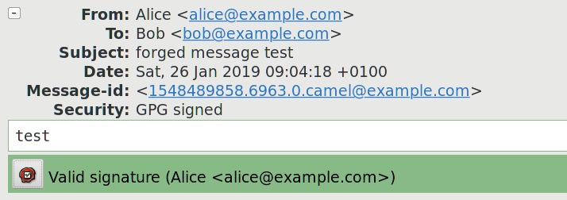

===============================================================
Evolution: UID trust extrapolation attack on OpenPGP signatures
===============================================================
:Author: Michał Górny
:Date: 2019-01-31
:Version: 1.0
:Copyright: https://creativecommons.org/licenses/by/3.0/

.. contents::

Abstract
========
This article describes the UI deficiency of Evolution mail client that
extrapolates the trust of one of OpenPGP key UIDs into the key itself,
and reports it along with the (potentially untrusted) primary UID.  This
creates the possibility of tricking the user into trusting a phished
mail via adding a forged UID to a key that has a previously trusted UID.

Background
==========

UID-oriented trust model
------------------------
The commonly used OpenPGP trust models are UID-oriented.  That is, they
are based on establishing validity of individual UIDs associated with
a particular key rather than the key as a whole.  For example,
in the Web-of-Trust model individuals certify the validity of UIDs they
explicitly verified.

Any new UID added to the key is appropriately initially untrusted.  This
is understandable since the key holder is capable of adding arbitrary
UIDs to the key, and there is no guarantee that new UID will not
actually be an attempt at forging somebody else's identity.

GnuPG Signature verification
----------------------------
OpenPGP signatures do not provide any connection between the signature
and the UID of the sender.  While technically the signature packet
permits specifying UID, it is used only to facilitate finding the key,
and is not guaranteed to be meaningful.  Instead, only the signing key
can be derived from the signature in cryptographically proven way.

GnuPG (as of version 2.2.12) does not provide any method of associating
the apparent UID (e.g. from e-mail's ``From`` header) against
the signature.  Instead, only the signature itself is passed to GnuPG
and its apparent trust is extrapolated from validity of different UIDs
on the key.  In other words, the signature is considered to be made with
a trusted key if at least one of the UIDs has been verified.

An example user-oriented output from such a verification lists UIDs
on the key along with their respective validity::

    gpg: Signature made sob, 26 sty 2019, 09:01:16 CET
    gpg:                using RSA key EDA1165366204A694417B2FC551A87083FDCFBF0
    gpg: Good signature from "Alice <alice@example.com>" [unknown]
    gpg:                 aka "Eve <eve@example.com>" [full]

However, the machine-oriented output provided to ``--status-fd`` is not
this verbose::

    [GNUPG:] NEWSIG
    [GNUPG:] KEY_CONSIDERED EDA1165366204A694417B2FC551A87083FDCFBF0 0
    [GNUPG:] SIG_ID dbb5pG09OgJI0cRPGjqs2ZFAqyw 2019-01-26 1548489676
    [GNUPG:] KEY_CONSIDERED EDA1165366204A694417B2FC551A87083FDCFBF0 0
    [GNUPG:] GOODSIG 551A87083FDCFBF0 Alice <alice@example.com>
    [GNUPG:] VALIDSIG EDA1165366204A694417B2FC551A87083FDCFBF0 2019-01-26 1548489676 0 4 0 1 8 01 EDA1165366204A694417B2FC551A87083FDCFBF0
    [GNUPG:] KEY_CONSIDERED EDA1165366204A694417B2FC551A87083FDCFBF0 0
    [GNUPG:] TRUST_FULLY 0 pgp
    [GNUPG:] VERIFICATION_COMPLIANCE_MODE 23

Specifically, note that this output includes:

- the key's primary UID (without its validity) in ``GOODSIG``,

- the key's full fingerprint in ``VALIDSIG``,

- the key's extrapolated trust in ``TRUST_*``.  [#GNUPG-DETAILS]_

As such, this output is not only unsuitable to verify whether the UID
used to send the message is trusted but also is not proof to mistakenly
associating the extrapolated trust with the primary UID provided
in output.

The signature check UI in Evolution
-----------------------------------
The Evolution mail client (as of version 3.26.6) converts the
machine-oriented GnuPG output into a user-friendly status bar.  This bar
indicates the signature check result using an explanatory message
and background color (red for failed verification, yellow for untrusted
signatures, green for trusted signatures).  It also includes the primary
UID of the key used to make the signature, and a button bringing
complete GnuPG output.

The signature bars for an example trusted and untrusted signatures
are presented below:

.. image:: evolution-uid-trust-extrapolation/trusted-sig.png

This status bar is created directly from the ``--status-fd`` output
presented above.  It combines the indicated key trust with the primary
UID of the key used to make the signature, independently of the UID's
validity itself.

Summary
=======
The attack is based on using the deficiency of Evolution UI when
handling new identifiers on previously trusted keys to convince the user
to trust a phishing attempt.  Please consider the following example:

Alice, Bob and Eve are all using OpenPGP, and they all have a single UID
on their key corresponding to their legitimate identity.  Through Bob's
Web-of-Trust, both Alice's and Eve's primary identifiers are trusted.

Now, Eve creates a new identifier that resembles the one belonging to
Alice, and sets it as her primary identifier.  Afterwards, she sends
an e-mail to Bob, with Alice's e-mail address in the ``From`` field,
signed with her own key.  Evolution displays the mail as presented
in the following screenshot:

Specifically, please note that the message `Valid signature (Alice
<alice@example.com>)` suggests that they mail has been signed with
a trusted key belonging to Alice.  However, the detailed output
reveals that the only trusted UID in the key belongs to Eve::

    gpg: Good signature from "Alice <alice@example.com>" [unknown]
    gpg:                 aka "Eve <eve@example.com>" [full]

Impact
======
This method can be used to easily trick the recipient into accepting
phished mail as legitimate.  However, it has a limited scope because:

1. It requires the attacker's key to gain recipient's trust,
   e.g. via OpenPGP WoT model.  As a result, it may require the attacker
   to disclose his identity or trick additional people into accepting
   a forged identity.

2. The mismatched identity is immediately apparent on key inspection,
   and therefore raises suspicion as to the key holder's legitimacy.

Solution
========
The issue has been reported upstream at 2019-01-26.  However, upstream
closed the bug report, claiming that the issue needs to be resolved
on GnuPG end.  [#EVOLUTION-BUG-REPORT]_

However, the existing GnuPG API should be sufficient to resolve
the problem.  In particular, Evolution could use ``--list-keys
--with-colons`` to easily determine validity of each UID corresponding
to the key::

    tru::1:1548488994:1611560841:3:1:5
    pub:f:2048:1:551A87083FDCFBF0:1548488894:1611560894::-:::scESC::::::23::0:
    fpr:::::::::EDA1165366204A694417B2FC551A87083FDCFBF0:
    uid:-::::1548488982::AD66BA4CCE5C5EE636FAD1BE2B9A0DB88903021E::Alice <alice@example.com>::::::::::0:
    uid:f::::1548488894::A608485EB3B3D764C07C4ECDE75D90422B705C6A::Eve <eve@example.com>::::::::::0:
    sub:f:2048:1:C21F342D44257AE6:1548488894::::::e::::::23:
    fpr:::::::::E4113A42D86B9D335B5D4167C21F342D44257AE6:

Detailed outline of the test case
=================================
In the following section, `profiles` will be used to reference
isolated directories used to store GnuPG keys and configuration.
The ``GNUPGHOME`` environment variable is used to specify the directory
to use.

The issue can be easily reproduced through the following steps:

1. Create new directories that will serve as ``GNUPGHOME`` for Alice,
   Bob and Eve.

2. Create keys for Alice, Bob and Eve using their profiles.  Add
   legitimate user identifier to each of them.

3. Export Alice's and Eve's keys from their profiles, and import them
   into Bob's.

4. Sign Alice's and Eve's keys using Bob's key.

5. Export signed Eve's key and import it into her profile.

6. Using Eve's profile, add a new user identifier to her key.  Make
   the UID resemble Alice's UID.

7. Export updated Eve's key and import it to Bob's profile.

8. Using Eve's profile, create a new signed mail in mbox format.  This
   can be done e.g. via creating a text file, using ``gpg --clearsign``
   to sign it, then prepending e-mail headers such as::

       From localhost
       From: Alice <alice@example.com>
       To: Bob <bob@example.com>
       Subject: forged message test

9. Import the resulting mail into Evolution, and open it.

References
==========
.. [#GNUPG-DETAILS] GnuPG Details
   (https://git.gnupg.org/cgi-bin/gitweb.cgi?p=gnupg.git;a=blob;f=doc/DETAILS;h=74a63ef007fdf1903918351ac281847098ab3828)

.. [#EVOLUTION-BUG-REPORT] Potential vulnerability: gpg key trust
   extrapolation to new UIDs · Issues · GNOME / evolution · GitLab
   (https://gitlab.gnome.org/GNOME/evolution/issues/299)

Comments
========
The comments to this article are maintained as part of the relevant
blog entry: `Evolution: UID trust extrapolation attack on OpenPGP
signatures`_.

.. _`Evolution: UID trust extrapolation attack on OpenPGP signatures`:
   https://blogs.gentoo.org/mgorny/2019/01/31/evolution-uid-trust-extrapolation-attack-on-openpgp-signatures/#comments
