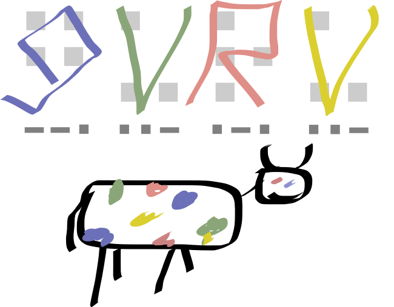
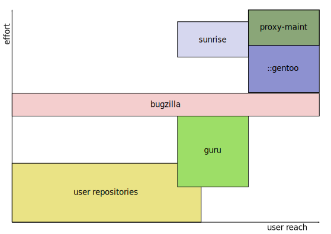

=================================================
GURU: a new model of contributing to Gentoo (WIP)
=================================================
:Author: Michał Górny
:Date: 2019-02-08
:Version: 0.1
:Copyright: https://creativecommons.org/licenses/by/3.0/

.. contents::

Preface
=======
Gentoo accepts user contributions via a number of venues.  Bugzilla,
the most traditional of them is suitable for helping developers fix
their packages but is strictly developer-oriented.  Proxy maintenance
is a great way to maintain packages by non-developers but requires
significant effort from both contributors and developers.  Third-party
repositories are cheap to create but not friendly to end users.

All this considered, there seems to be a gap between overlays and proxy
maintenance.  GURU aims to fill this gap, by combining relatively low
effort required to push with high visibility of well-known official
repository.  While using a rather different design, it is meant to be to
Gentoo what AUR is to Arch Linux.  [#AUR]_

The project is somewhat similar to Sunrise, except that it eliminates
the reliance on developers to review commits.  Instead, it focuses
on Wiki-like community workflow where everybody can work together
to improve packages, and users gain reputation via doing good work.
Users who already gained reputation use it to review packages, merge
them for public consumption and at the same time raise reputation
of the users submitting them.  This creates self-sustainable community
where Gentoo developer intervention is rarely necessary.

Existing and historical contribution models
===========================================

Bugzilla and e-mail submissions
-------------------------------
Over the history of Gentoo, I think Bugzilla can clearly be classified
as the primary venue of interaction between users and developers.  Be it
bug reports, enhancement suggestions or new package requests, all
of them allowed for the users to attach patches or new ebuilds.

The most important characteristic of this venue is that the result
of user's action entirely relied on an existing Gentoo developer taking
care of it.  The files attached by the users may help the developer but
the user can not directly cause anything to happen.  If user submits
a new package, he can't make it happen without finding an interested
developer.

Bugzilla is presented as a canonical example of this contribution model.
The same model is expressed e.g. by e-mail submissions, IRC pastes, etc.

The Sunrise project (historical)
--------------------------------
The Sunrise project was a historical Gentoo project built around
user-maintained, developer-reviewed package repository.  At the time
when I joined Gentoo, it was the primary venue for users to work on new
packages and receive training necessary to become Gentoo developers.
After all, many new Gentoo developers at the time (myself included)
started with Sunrise.

The Sunrise model was based on a repository with two branches: a main
branch where all users worked and a reviewed branch that was meant for
public consumption.  All users were expected to request review on IRC
for their changes, and only commit once receiving an approval from
a Sunrise developer.  Furthermore, Sunrise developers periodically did
review late commits (again) and merge them to the reviewed branch.

Sunrise eventually become defunct due to loss of interest both
on developer and user side.  Eventually, it has been discontinued
in June 2016.  [#SUNRISE]_

Proxied maintainers
-------------------
The downfall of Sunrise was paralleled by rise of proxy-maintenance.
In this model, users are allowed to maintain packages straight
in the Gentoo repository, with one or more developers proxying
the commits for them.

While this concept has been (and still is) applied to individual
user-developer pairs, forming the Proxy Maintainers project was
a turning point for its growth.  This project focused on gathering
developers that were interested in serving users as proxies,
and eventually replaced the 1:1 model with M:N where a number of
developers freely proxy a number of users.  [#PROXY-MAINT]_

The historical purpose of proxy-maint project was to find new
maintainers for abandoned packages in Gentoo.  Today (and especially
since GitHub was adopted) the majority of submissions involves new
packages.

The main advantage of proxy-maint is that it allows the users to take
responsibility and share their work to all Gentoo users through
the official repository.  However, applying those contributions requires
significant effort both from users and developers, and so far
the proxy-maint team is continuously overwhelmed and unable to process
contributions in satisfactory time.

User repositories (overlays)
----------------------------
Finally, another possibility for users to publish their work is to
create their own repositories, historically called ‘overlays’.  There
is a great multitude of kinds of repositories and their uses.  We have
personal, project and quasi-public overlays.  We have repositories
focused on a single package suite, software category, and holding all
different kinds of applications.  We have cross-repository dependencies,
we have overrides for Gentoo packages.  We have repositories of great
quality, and literal ‘dumps’ of random ebuilds.  Finally, we have
completely unpredictable mixes of all that.

The most important advantage of third party repositories is that they
are trivial to create and cheap to maintain.  You can practically commit
anything you like to your personal overlay, without having to pass any
review or convince any Gentoo developer to accept it.  With a little
more effort, you can get it published on the official list, and make
it possible for users to trivially start using it.

However, this implies all disadvantages of the generic case of this
model.  Users are subject to a great number of repositories of varying
quality and size.  If you need to find a particular package, you may be
required to choose from a number of overlays with no clear indication
which may serve your purpose better.  If you add a particular overlay,
you may discover it actually overrides other packages you did not want
replaced.  Finally, since there's no real supervision of what happens
in all those repositories, it is trivial to inject malware.

Project repositories
--------------------
I believe it is worthwhile to isolate a special case of third-party
repositories — project overlays.  Besides aforementioned Sunrise
project, some examples of long-lived Gentoo project overlays are
the GNOME, KDE, Science or Java overlays.

Their distinguishing quality is that they are focused on a specific yet
broad topic and supervised by actual Gentoo developers.  However, they
frequently give commit access to various external contributors,
providing them with an opportunity to work with the project members (or
even become them — if you disregard the limitation of Gentoo Wiki
preventing non-developer project members).

Furthermore, those project overlays frequently serve as staging ground
for Gentoo repository ebuilds.  Therefore, the work of users eventually
makes it to the official repository.

Effort-reach comparison
-----------------------

   
   Chart presenting effort-to-user-reach for different contribution
   venues

The above chart attempts to describe where GURU fits graphically.
The vertical axis represents the *effort*, i.e. how much time and work
adding a package takes.  The horizontal axis represents *user reach*,
i.e. how many users will find the package added.

The middle line representing Bugzilla is taken as a reference point.
In case of Bugzilla, the actual reach depends on whether any developer
actually takes the patch/ebuild.

On one end of the graph, we have user repositories where
the effort is relatively low and user reach depends on the popularity
of particular repository.  On the other end, we have commits made
directly to the Gentoo repository which have the highest reach.

Proxy-maint is placed above Gentoo as reviewing and training
contributors requires more effort (and of more people) than committing
packages yourself.  Sunrise is nearby, with its high standards still
requiring significant effort and good popularity.

GURU aims to achieve similar level of popularity as Sunrise; however
with lower cumulative effort.  On one hand, some users will take
the extra effort to review packages.  On the other, it also provides for
one-time package submitters.

The proposed GURU model
=======================

Repository layout
-----------------
GURU uses a layout similar to the one historically used by the Sunrise
project.  There are two branches: the development branch maintained
directly by users, and the reviewed branch intended for public
consumption.

All GURU users obtain access to the development branch upon requesting
it.  Since this opens a possibility of seriously broken or even
malicious code being committed, this branch is only intended to be used
by GURU contributors, and only in the scope specific to their individual
development efforts (i.e. even they should not add it to
``repos.conf``).

The reviewed branch is entirely maintained by scripts.  The commits
from development branch are merged into reviewed branch as soon as they
are reviewed, through automated scripts.

User access and workflow
------------------------

Classes of users
~~~~~~~~~~~~~~~~
Initially, three user classes are defined:

1. *Regular users* — all new users belong to this class.  Regular users
   are permitted to commit to the development branch, and to flag
   commits.  However, they can't review packages.

2. *Trusted users* — regular users are promoted to trusted users once
   they gain 10 reputation points.  Trusted users can additionally
   review commits and therefore effect their merge to the reviewed
   branch.

3. *Developers* — existing Gentoo developers belong to this class.  They
   are permitted to review commits and also to remove flags.

Users gain 1 reputation point every time a batch of commits containing
their commit is merged.  In other words, a user becomes trusted after
reaching 10 accepted separate contributions.

This model aims to provide self-sustainable user community while
protecting the repository against using newly-created accounts to
perform malicious actions.  While new users could potentially commit
malicious code, it would have to normally pass review of multiple
already trusted individuals which is unlikely.  In order to be able to
review their own code, they would have to first put an effort into
gaining trusted user status.

Gentoo developers are given special status for two reasons: firstly,
to act as moderators who can react to acts of malice or vandalism;
and secondly, as initial group needed to bootstrap the trusted user
model.  Once initial developer reviews elect first trusted users, those
users can take most of the reviewing over and the repository becomes
self-sustainable.

Commit reviews and merging
~~~~~~~~~~~~~~~~~~~~~~~~~~
The commit reviews are also based on scoring system.  Reviews are
normally performed on commit ranges, and each approval gives all commits
in the range specific score:

- 1 point if the review is performed by a trusted user,

- 3 points if the review is performed by a developer.

Once a commit reaches the score of 3 points, it can be merged to
the reviewed branch.  This implies that normally the reviewed branch
is merged either if a developer reviews commits, or 3 distinct trusted
users do.

Flag mechanism
~~~~~~~~~~~~~~
The flag mechanism is added in order to provide stronger protection
against malicious or otherwise harmful actions.  Any user (including
untrusted users) can flag a commit as either *malicious*, *vandalising*
or *suspicious*.  The flagged commit is reported to the community
and blocks merging the changeset, even if it reached the necessary
score.

Once a flag is set, it can only be removed by a developer.  Once
the developer confirms that the danger is resolved, the flag is removed
and merging can proceed again.  The developer can also issue bans
and other measures against the individual responsible for the commit.

Package maintenance
-------------------

Classes of packages
~~~~~~~~~~~~~~~~~~~
The GURU repository is primarily meant for new packages, that is
packages that are not present in the Gentoo repository.  Additionally,
it is acceptable to provide new versions of packages that are
unmaintained.  It is *not* acceptable to override Gentoo packages;
if there is a very good reason to fork them, the fork should be named
accordingly and not interfere with the Gentoo original.

Accordingly, if a GURU package is adapted (or independently added)
into the Gentoo repository, it should be afterwards removed from GURU.
This removal can be done by anyone.

Maintainers
~~~~~~~~~~~
GURU allows for both community-maintained and individual-maintained
packages.  However, it enforces no technical access restrictions nor
strong maintainer boundaries.  The former class of packages is
identified by lack of maintainer in ``metadata.xml`` (or an explicit
comment stating that community contributions are welcome), the latter
by an explicitly listed maintainer.

The primary purpose of defined maintainers is to provide a contact point
for bugs reported against the package in question.  If other users wish
to contribute to the package, it is a good practice to contact
the listed maintainer first.  However, there is no punishment planned
for non-destructive cases of non-maintainer commits.

Bug reporting
~~~~~~~~~~~~~
All bugs reported to GURU packages will be reported both to specific
package maintainers and a GURU mailing list including all users.  All
users are responsible for keeping GURU in good shape, and therefore all
users are asked to process bug reports.

Implementation choices
======================

Implementation requirements
---------------------------
The GURU project requires a git hosting and a review system.
The cumulative requirements for both are:

- user access control, with accounts being associated to commits,

- git update hooks that can reject non-conformant commits,

- per-branch access control,

- possibility for minimal CI integration (i.e. commit status
  information visibility),

- ability to store per-user and per-commit reputation and flags,

- ability to distinguish user types and their limitations in reviews
  and flag control,

- good diff view.

Both elements can either be part of a single product, or be made of two
or more complementary pieces.  Notably, the review system will most
likely require some custom coding; though it would be desirable to reuse
as much of existing systems as possible.

Git hosting solutions
---------------------

gitolite + cgit setup used by Gentoo
~~~~~~~~~~~~~~~~~~~~~~~~~~~~~~~~~~~~
Gitolite is a git hosting backend focused on SSH access, and featuring
configuration via git repository.  It is pretty powerful, allowing
for a lot of customization, including per-branch access control and any
set of git hooks.  The account creation is manual; however, it can
easily be semi-automated using scripts, so that should not cause
an issue as long as GURU continues to require manual account approval.
[#GITOLITE]_

cgit is a web frontend for git repositories.  Its most notable quality
is that it is written in C (based on hacking git sources) and this gives
it great performance compared to the alternatives.  However, it is
focused on read-only access to the repositories and does not supply
anything very useful for the project.  [#CGIT]_

An important advantage of the two is that Gentoo Infrastructure has them
deployed.  Therefore, taking advantage of them might both reduce
the amount of extra work necessary and avoid the discontent proprietary
alternatives would cause.  However, there are many areas (reviews, CI
integration) that would need to be implemented separately.

GitHub (and similar SaaS solutions)
~~~~~~~~~~~~~~~~~~~~~~~~~~~~~~~~~~~
GitHub is presented here as an example of a SaaS solution.  There are
multiple alternatives, more or less with the same functionality,
therefore I do not find it necessary to consider them separately.

GitHub is probably the biggest proprietary hosting site for git
repositories.  It provides free hosting for public repositories,
along with a number of useful features.  I am going to consider them
in context of possible GURU implementation.  [#GITHUB]_

GitHub makes it trivial to add new users to repositories.  Notably, it
removes the necessity of manually maintaining SSH keys, and given its
popularity it enables a number of users to contribute without having
to create a separate account.

It provides for good integration with external applications, including
some free SaaS CI providers and possible external software written
to provide status checks, reviews, etc.  Besides providing API access
to the repository and its GitHub-specific features, it also provides SSO
that could avoid maintaining two account systems.

On the negative side, its flexibility is limited.  It does not provide
for third-party update hooks.  While branch restrictions could be used
to implement a subset of GURU review goals (a protected branch where
people could only merge commits via creating a pull request and having
it reviewed by N other users), they are not powerful enough to implement
the full goal set.

Finally, since the service is proprietary some users are vehemently
opposed to using it.  This problem could possibly be lessened by using
open source SaaS such as GitLab but not eliminated entirely.

GitLab and similar platforms (Infra deployment)
~~~~~~~~~~~~~~~~~~~~~~~~~~~~~~~~~~~~~~~~~~~~~~~
TODO

Custom review front-end design
------------------------------

Web-based front-end
~~~~~~~~~~~~~~~~~~~
Common project design practices suggest that the review front-end should
be built as web application.  Such an application would have to provide
a user-friendly review UI with clean diff view, easy access to common
review actions and clean indication of commit states.  Such a task is
entirely doable.

However, web UI poses a specific problem: since SSH (as used to
authenticate committers) is not really suitable for regular HTTPS
authentication, it requires a duplicate account system with a different
authentication mechanism.  This is technically doable, especially that
all the common frameworks provide such a system.  However, it increases
account maintenance overhead.

Git-based front-end
~~~~~~~~~~~~~~~~~~~
One particularly interesting alternative is to use git as database
directly, rather than requiring a separate web front-end.  In this
model, the reviewing is done via a dedicated CLI or GUI application
that afterwards stores results as specific git objects.  The action
is committed via pushing the objects to server.

Most notably, this removes the necessity for a separate authentication
mechanism.  Since all actions are pushed via git, the existing git
authentication framework will suffice.  However, at the same time it
becomes necessary for the server-side hooks to be able to verify
the incoming requests and reject those which exceed user's permissions.

Furthermore, unless we can use additional server-side data storage,
it becomes necessary for the hook to repeatedly reevaluate user
and commit status in order to devise appropriate actions.  For example,
when users submit a commit range review, the system would need to first
reevaluate user's reputation, verify whether he is allowed to submit
the review, apply appropriate commit reputation updates and finally
reevaluate the resulting reputation of individual commits and possibly
merge them to the reviewed branch.

Questions & answers
===================

GURU vs other projects
----------------------
Will GURU replace proxy-maint (/ some other project)?
  No, GURU is meant to be an entirely new project, aiming to fill
  in a specific gap.  While it is possible that some users will resign
  from contributing via proxy-maint in favor of GURU, it should be noted
  that unlike proxy-maint, it does not provide a way to get your
  packages to the Gentoo repository.

How is GURU different from Sunrise?
  There are indeed many similarities between GURU and Sunrise.  However,
  the main difference is that Sunrise explicitly relied on developers
  reviewing all the commits, while GURU aims to build a self-sustainable
  reviewer base within the user community.

Why not revive Sunrise instead?
  I believe that Sunrise died mostly because of lack of interest.  While
  bringing it up again might get it running for some time, there is
  no reason to believe that it would meet the same end soon enough.
  Therefore, I think it is better to try something else.

GURU for users
--------------
Will GURU repository by enabled by default?
  There are no such plans at the moment, and I honestly doubt it will
  happen in the future, at least with the currently planned contribution
  model.  Most notably, GURU is not meant to force the high standards
  that are (at least theoretically) required for the Gentoo repository.

How is GURU protected against malicious users?
  The primary protection is the review model.  If a malicious user
  obtains access to the repository (which is entirely possible given
  no specific verification of new users), existing users should be able
  to notice his actions and reject them at review level.

  For a malicious agent to be able to push changes to the reviewed
  repository itself, it would technically need to create three users
  first, and obtain trusted user status for each of them.  While this is
  not impossible, it is considered costly enough to limit the attack
  scope.  Of course, once the resulting attack is noticed, the accounts
  will be blocked and the attacker would have to start over.

  A malicious user causing mayhem in the development repository is
  a more likely threat.  However, this will not reach end users,
  so the end value of such an attack would be rather low (i.e. it would
  be vandalism).  Furthermore, all the accounts will be confirmed
  manually, technically restricting the ability of quickly creating
  multiple accounts.

The acronym
-----------
What does GURU stand for?
  It's a secret known only to the most trusted GURU users.  However,
  the expansion most likely includes the words ‘Gentoo’, ‘User’
  and ‘Repository’.  Not necessarily in this order.

…but what about the second ‘U’?
  Yeah, the little bugger likes to make trouble.  However, it wouldn't
  be half as cool without it — imagine GUR, or maybe GRU (but then we
  would risk being despicable).  Choose some U-word yourself.
  Suggestions include ‘Unique’, ‘Ubiqi… Ubiquitous!’, ‘Umbrella’,
  ‘Ubuntu’… oh, wait.

Is GURU a recursive acronym?
  Sure, why not.  ‘GURU Ur Repository, Umph!’

Why is there a whole section dedicated to the acronym?
  Because it is the single most important quality of the project!
  Do you think anyone would have really look at it if it was named
  ‘random new user-contributed repository without a cool acronym’?
  Do you think I would be motivated to actually design this and deal
  with all the criticism if I haven't thought of that acronym
  in the first place and didn't want it to go to waste?  I don't think
  so.

The logo
--------
What's with the 9… I mean, G?
  It was supposed to resemble the Gentoo ‘g’.  Except after four
  strikes, it looked kinda non-g, so I've added the fifth strike.  Then,
  a few minutes later I've realized that it's flipped horizontally.
  However, since it was a few minutes after its inception, it became
  classic already and I didn't change it.  After all, isn't the Gentoo
  ‘g’ flipped actually?

What's with the V?
  Look at some random ancient Latin writings, and you're going to notice
  ‘U’ being written as ‘V’.  The logo follows that tradition.
  For no reason whatsoever.

Is there anything special about the R?
  Nope, sorry.  Incidentally it looks like R, behaves like R and nobody
  so far has had any reason to think otherwise.  If anything changes,
  I'll let you know.

What are those squares in the background?
  That's Braille alphabet, obviously.  I do care about accessibility,
  and since the cost of adding Braille name was practically
  non-existent, why not?

What are those dots and dashes below?
  Morse code, obviously.  Probably doesn't have any value.

What's with the cow?
  What cow?

The cow on the logo.  The one below the GURU.
  Someone asked for it, so I've added it.

…but who's that cow?  Is that supposed to be Larry?
  That's Леони́д, Larry's gender-neutral sibling who's been kidnapped
  by mad СССР scientists.  Don't ask him about the spots.

Are you serious?
  Nope.

References
==========
.. [#AUR] Arch User Repository - ArchWiki
   (https://wiki.archlinux.org/index.php/Arch_User_Repository)

.. [#SUNRISE] Sunrise - Gentoo Wiki
   (https://wiki.gentoo.org/wiki/Sunrise)

.. [#PROXY-MAINT] Project:Proxy Maintainers - Gentoo Wiki
   (https://wiki.gentoo.org/wiki/Project:Proxy_Maintainers)

.. [#GITOLITE] Gitolite
   (http://gitolite.com/gitolite/)

.. [#CGIT] cgit - A hyperfast web frontend for git repositories written
   in C
   (https://git.zx2c4.com/cgit/)

.. [#GITHUB] GitHub
   (https://github.com)
